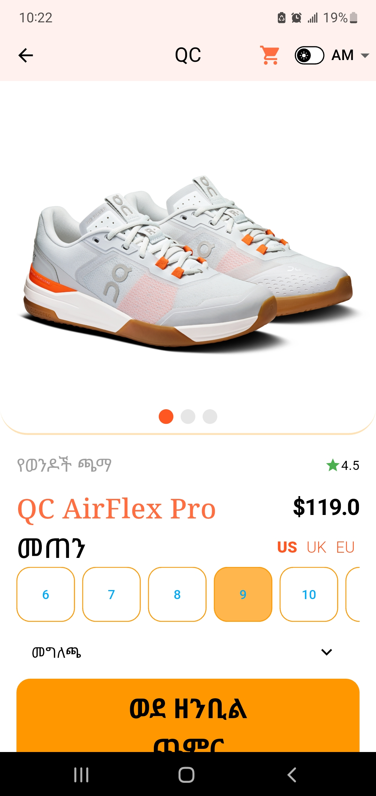
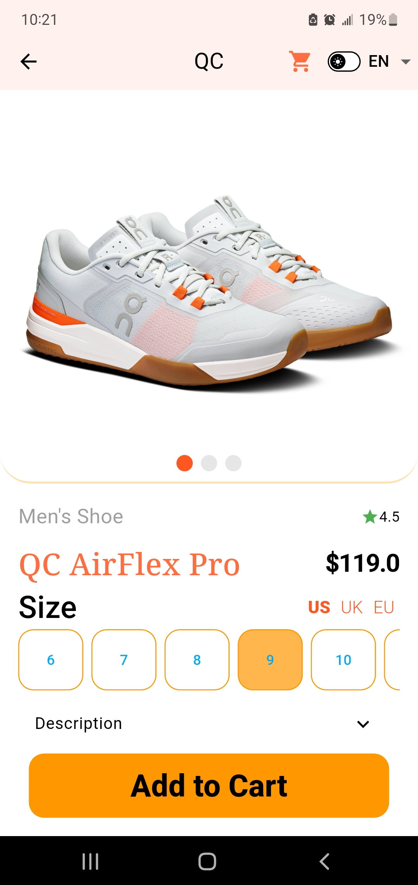
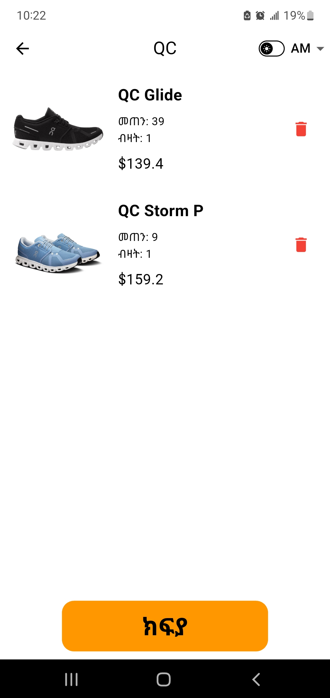
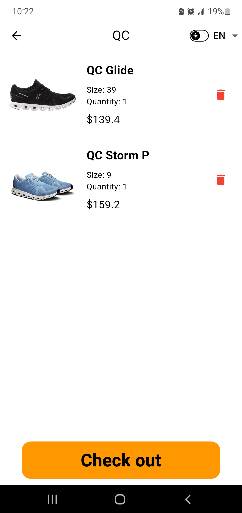
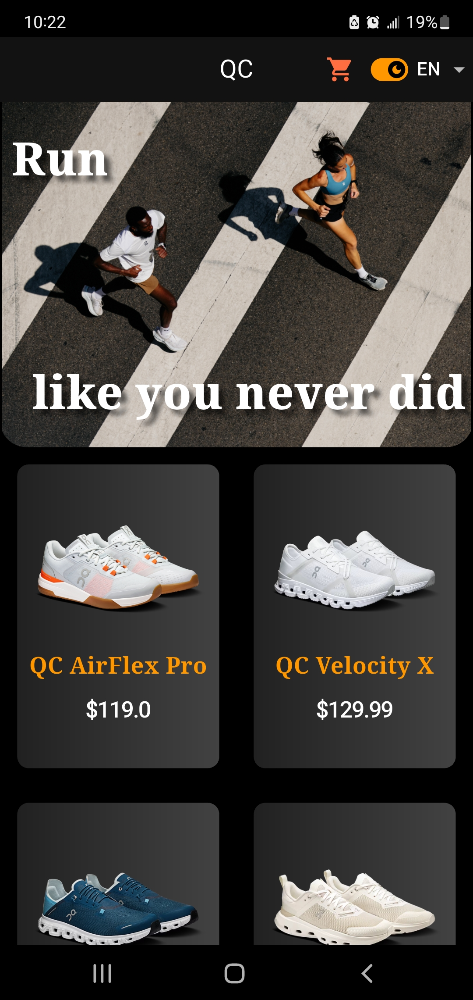
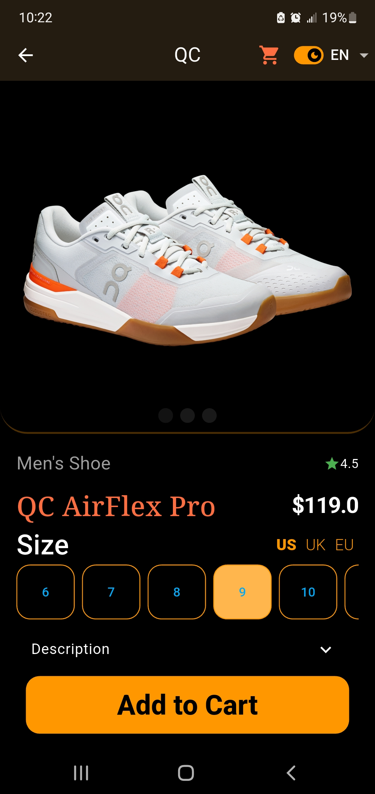
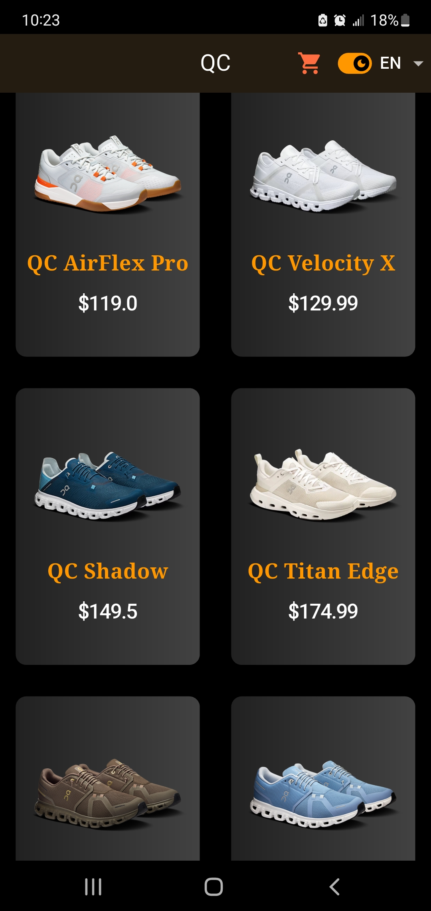
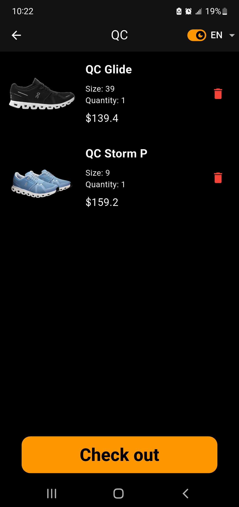

# 👟 Chama Shoe App

A simple Flutter application that displays a collection of shoes with a clean and user-friendly
interface. The app supports multiple languages and theme switching for better user experience.

---

## Features

- Home screen displaying a list of shoes
- Detailed view for each shoe
- Dark and light theme support
- Language support (English and Amharic)
- Smooth navigation between screens
- Clean and responsive UI design

---

## Screenshots

### Light Theme

| English                                           | Amharic                                           |
|---------------------------------------------------|---------------------------------------------------|
|     |   |
|   |  |
|       |


### Dark Theme (English)

| Home | Details |
|------|--------|
|  |  |

<!-- ### Dark Theme

| English                                                    |
|------------------------------------------------------------|
|   |
|   |
|   |
|  | -->

---

## Built With

- Flutter
- Dart
- Flutter localization (for language support)

### Packages used

- Provider (for state management)
- SmoothPageIndicator

---

## Project Structure

````
lib/
│
├── main.dart
├── home_screen.dart
├── detailed_screen.dart
├── shoe_data.dart
├── shoe_model.dart
├── cart_provider.dart
├── cart_screen.dart
├── cart_shoe_model.dart
├── reusable_widgets.dart
└── l10n/ (localization files)
````

## Features Overview

### Theme Support

The app allows users to switch between light and dark modes for better readability in different
environments.

### Language Support

The app supports:

- English
- Amharic (አማርኛ)

Users can switch languages dynamically using the app settings.

---

## Getting Started

### Prerequisites

Ensure Flutter is installed:

```bash
flutter --version
````

### Installation

Clone the repository:

```bash
git clone https://github.com/Ermi-haimi/Chama-shoe-app.git
```

Navigate to the project:

```bash
cd Chama-shoe-app
```

Install dependencies:

```bash
flutter pub get
```

Run the app:

```bash
flutter run
```

---

## Future Improvements

* Add user authentication
* Improve UI animations
* Connect to backend API
* Add search and filtering
* Improve localization coverage

---

## Author

* GitHub: https://github.com/Ermi-haimi

---

## License

This project is open source and available under the MIT License.


